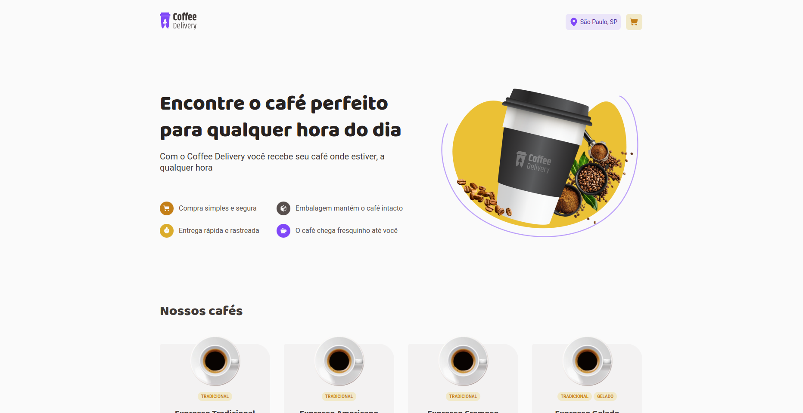
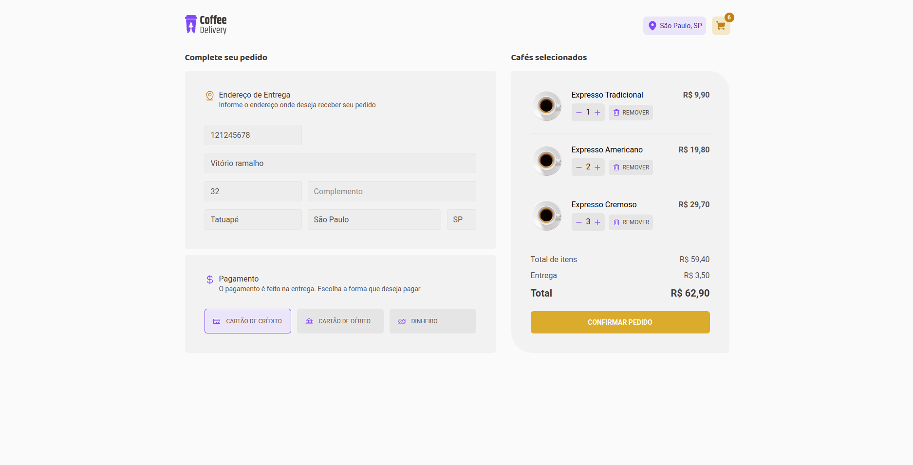

<h1 align="center">
  
</h1>

<h3 align="center">
  Coffee delivery
</h3>

<p align="center">Coffee delivery App</p>

<p align="center">
  <a href="#-about-the-project">About the project</a>&nbsp;&nbsp;&nbsp;|&nbsp;&nbsp;&nbsp;
  <a href="#-technologies">Technologies</a>&nbsp;&nbsp;&nbsp;|&nbsp;&nbsp;&nbsp;
  <a href="#-getting-started">Getting started</a>&nbsp;&nbsp;&nbsp;|&nbsp;&nbsp;&nbsp;
  <a href="#-license">License</a>
</p>

## 👨🏻‍💻 About the project

- <p style="color: red;">Coffee delivery website</p>




## 🚀 Technologies

Technologies that I used to develop this web client

- [ReactJS](https://reactjs.org/)
- [TypeScript](https://www.typescriptlang.org/)
- [React Router DOM](https://reacttraining.com/react-router/)
- [React Hook Form](https://react-hook-form.com/)
- [Yup](https://github.com/jquense/yup)
- [Styled Components](https://styled-components.com/)
- [React toastify](https://fkhadra.github.io/react-toastify/introduction)
- [Eslint](https://eslint.org/)
- [Prettier](https://prettier.io/)

## 💻 Getting started

### Requirements

**Clone the project and access the folder**

```bash
$ git clone https://github.com/joao-garcia404/coffee-delivery && cd coffee-delivery
```

**Follow the steps below**

```bash
# Install the dependencies
$ yarn

# Start the client
$ yarn dev
```

## 📝 License

This project is licensed under the MIT License - see the [LICENSE](LICENSE) file for details.

---

Made with 💜 &nbsp;by João Vitor Garcia 👋 &nbsp;[See my linkedin](https://www.linkedin.com/in/joao-garcia404/)
